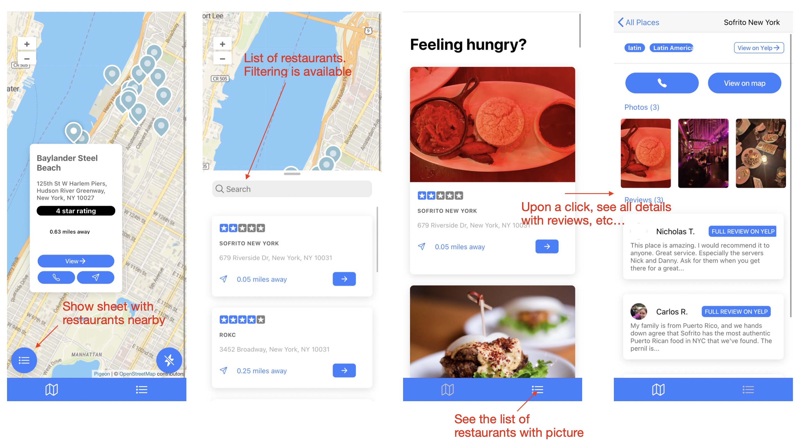

# restaurant-lookup

## Table of Contents
- [Description](#description)
- [Prerequisites](#prerequisites)
- [Installation](#installation)
- [Technologies](#technologies)
- [Contact](#contact)

## Description

This application is an Ionic ReactJS app designed to help users find restaurants in their vicinity. The user interacts with a map displaying various restaurants within a certain radius. Details about each restaurant, including reviews, contact information, and menu offerings, can be accessed through pointers on the map. The app is geared towards mobile devices but at this development stage is presented as a Progressive Web App (PWA).

## Prerequisites

Before you begin, ensure you have met the following requirements:
- You have installed the latest version of [Node.js and npm](https://nodejs.org/)
- You have a basic understanding of ReactJS and Ionic Framework

## Installation

To install the restaurant-lookup app, follow these steps:

1. Clone the repository:
```
git clone https://github.com/jparraporcar/restaurant-lookup.git
```
2. Navigate into the project directory:
```
cd restaurant-lookup
```

3. Install the dependencies:
```
npm install
```
4.In a separate terminal tab, navigate to the src directory and start the server:

```
cd src
node server.js
```

5. start the application in development (http://localhost:3000/map):
```
npm start
```

## Technologies

The restaurant-lookup app utilizes various technologies for its implementation:

1. **[Ionic Framework with React.js](https://ionicframework.com/react)** - A popular cross-platform framework used for building mobile and desktop applications using web technologies (HTML, CSS, JavaScript/TypeScript).
2. **[Capacitor](https://capacitorjs.com/)** - A cross-platform native runtime that makes it easy to build web apps that run natively on iOS, Android, Electron, and the web.
3. **[Redux Toolkit](https://redux-toolkit.js.org/)** - The official, opinionated, batteries-included toolset for efficient Redux development.
4. **[Express.js](https://expressjs.com/)** - A minimal and flexible Node.js web application framework that provides a robust set of features for web and mobile applications.
5. **[Pigeon Maps](https://pigeon-maps.js.org/)** - ReactJS maps without external dependencies.
6. **[Workbox](https://developers.google.com/web/tools/workbox)** - A set of libraries and Node modules that make it easy to cache assets and take full advantage of features used to build Progressive Web Apps.

## Usage

<figure>
  <figcaption>App flow</figcaption>
  <br />
  <br />
  
</figure>

## Contact

If you want to contact me you can reach me at:

- **Name**: `Jordi Parra Porcar`
- **Email**: `jordiparraporcar@gmail.com`
- **LinkedIn**: [`Jordi Parra Porcar`](https://www.linkedin.com/in/jordiparraporcar/)


